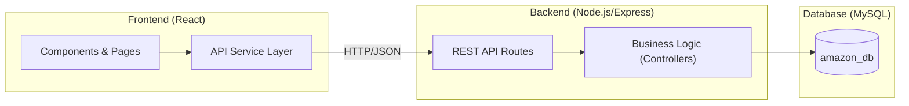

# Amazon Clone - Full Stack E-commerce Application

A full-featured Amazon clone built with React, Node.js (Express), and MySQL. This project features a professional frontend, a robust backend API, and a fully integrated database.

## 🚀 Features

- **Integrated Search**: Real-time product filtering as you type.
- **User Authentication**: Secure Login and Registration with hashed passwords.
- **Product Catalog**: 13 premium products with high-quality images and dynamic detail pages.
- **Shopping Cart**: Fully functional cart synced with the backend (add, remove, quantity updates).
- **Product Reviews**: Logged-in users can view and post reviews.
- **Checkout Process**: Simulated payment and order processing.
- **Premium UI**: Responsive design with Amazon-inspired aesthetics.

## 🏗️ Architectural Overview

The application follows a classic **3-Tier Architecture** for scalability and separation of concerns:



### Tech Stack Implementation
- **Frontend State**: Managed via React `useState` and `useEffect` for reactive updates.
- **Service Layer**: Centralized `api.js` using `fetch` with modularized async/await logic.
- **RESTful Design**: API endpoints follow REST conventions (e.g., `GET /products`, `POST /cart/add`).
- **Data Persistence**: MySQL with `mysql2` driver handles complex relationships between Users, Products, Cart, and Reviews.

## 🛡️ Scalability & Security Improvements

- **Environment Variables**: Moved hardcoded credentials to `.env` files (Scalability).
- **Password Hashing**: Uses `bcryptjs` for secure user credential storage.
- **Scalable DB Schema**: Uses `UNIQUE` constraints and `Foreign Keys` (to be added) for data integrity.
- **Middleware**: Integrated `cors` and `express.json()` for standardized request handling.

## 🏁 Getting Started

### 1. Database Setup
Ensure you have MySQL installed and running. Update your credentials in `amazon-backend/config/db.js` and `amazon-backend/init_db.js`.

Initialize and seed the database:
```bash
cd amazon-backend
node init_db.js
```

### 2. Start the Backend
```bash
cd amazon-backend
npm start
```

### 3. Start the Frontend
Open a new terminal:
```bash
npm start
```

Your app will be running at `http://localhost:3000`.

## 🤝 Contribution

Feel free to fork this project, open issues, or submit pull requests to improve the features!

---
*Created as part of an Advanced Agentic Coding project.*
