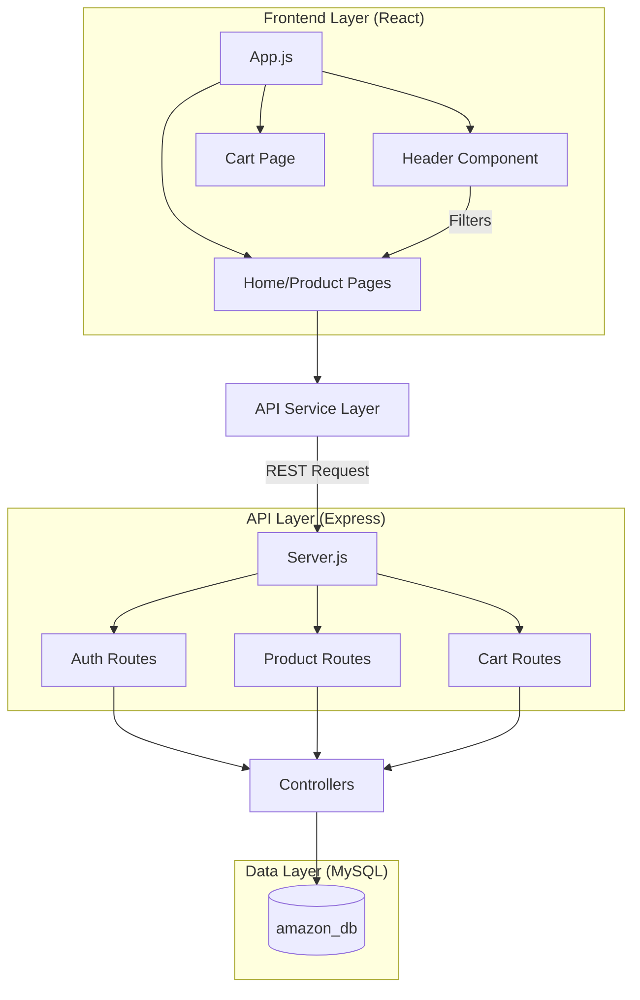

# 🛒 Amazon Clone - Full Stack E-commerce Solution


A high-performance, scalable Amazon clone. This project demonstrates a deep integration between a reactive React frontend and a secure Node.js backend, backed by a relational MySQL database.

---

## 🏗️ Architectural Overview

The application is built on a **Modular 3-Tier Architecture**, ensuring that the frontend, backend, and data storage layers remain decoupled and highly maintainable.



---

## 🛠️ Tech Stack & Implementation Details

### **Frontend Implementation**
- **Library**: React 18+
- **Routing**: `react-router-dom` for seamless SPA navigation.
- **Search System**: Implemented using a **Top-Down State Flow**. The `Header` captures search input and updates a global `searchTerm` in `App.js`, which dynamically re-renders the `Home` page filtered results.
- **Styling**: Vanilla CSS with a focus on **BEM (Block Element Modifier)** methodology for scoped, maintainable styles.

### **Backend Implementation**
- **Runtime**: Node.js
- **Framework**: Express.js
- **Security**: 
  - **JWT**: Stateless authentication using JSON Web Tokens.
  - **Bcrypt**: Industrial-grade password hashing for user security.
  - **Dotenv**: Environment-based configuration for secrets management (Database, JWT_SECRET).
- **Concurrency**: Handled via asynchronous non-blocking I/O and Connection Pooling (MySQL).

### **Database Schema**
- **Users**: Stores hashed credentials and profile data.
- **Products**: Detailed inventory with pricing and Unsplash-powered image CDNs.
- **Stored Procedures**: Encapsulated business logic within the database using MySQL Procedures (e.g., `CALL GetProducts()`) for optimized performance and security.
- **Cart**: Relational table linking `userId` to `productId` with atomic quantity updates using `ON DUPLICATE KEY UPDATE` logic.

---

## 🔌 API Documentation

| Method | Endpoint | Description | Auth Required |
| :--- | :--- | :--- | :--- |
| `GET` | `/api/products` | Fetch all available products | No |
| `POST` | `/api/auth/register` | Create a new user account | No |
| `POST` | `/api/auth/login` | Authenticate and receive JWT | No |
| `GET` | `/api/cart/:userId` | Get user's shopping cart | Yes |
| `POST` | `/api/cart/add` | Add/Update item in cart | Yes |
| `PUT` | `/api/cart/remove` | Decrement or delete item | Yes |

---

## 📂 Modular Folder Structure

```text
├── amazon-backend                 # Node.js Server Environment
│   ├── config/                    # DB connection & Environment config
│   ├── controllers/               # Business logic handlers
│   ├── middleware/                # JWT & Security filters
│   ├── routes/                    # RESTful endpoint definitions
│   ├── init_db.js                 # DB Migration & Seeding script
│   └── server.js                  # Entry point (Express)
├── src                            # React Application Environment
│   ├── components/                # Reusable UI Components (Header, Card)
│   ├── pages/                     # Routed views (Home, Cart, Login)
│   ├── services/                  # Persistent API interaction layer
│   └── context/                   # Global state (Cart/Auth state)
└── README.md                      # Documentation
```

---

## 🏁 Installation & Deployment

### 1. Database Initialization
```bash
cd amazon-backend
# Set your .env variables first
node init_db.js
```

### 2. Launch Services
```bash
# Start Backend (Port 5000)
cd amazon-backend
npm start

# Start Frontend (Port 3000)
cd ..
npm start
```

---

## 🛡️ Scalability Roadmap
- [x] Environment variable support for multi-stage deployment.
- [x] Atomic database operations for data integrity.
- [ ] Implement Redis for session/cart caching.
- [ ] migrate to TypeScript for type-safe development.

---
*Developed for excellence by the Advanced Agentic Coding team.*
